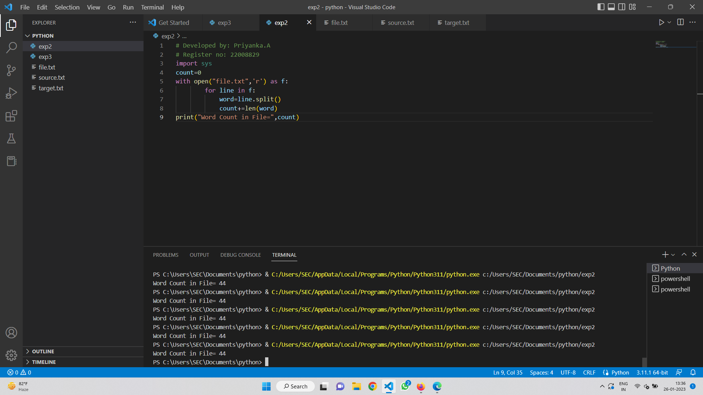

# command-line-arguments-to-count-word
## AIM:
To write a python program for getting the word count from the contents of a file using command line arguments.
## EQUIPEMENT'S REQUIRED: 
PC
Anaconda - Python 3.7
## ALGORITHM: 
### Step 1:
First we want to create a text file.
### Step 2: 
Then we want to create a python file. 
### Step 3: 
In that python file we want to write apython code to display
a word count.
### Step 4:  
We want to use commant with Open in that type that saved text file.
### Step 5: 
Then write a revelant program.

## PROGRAM:
```
# Developed by: Priyanka.A
# Register no: 22008829
import sys
count=0
with open("file.txt",'r') as f:
        for line in f:
            word=line.split()
            count+=len(word)
print("Word Count in File=",count)
 ```       

### OUTPUT:




## RESULT:
Thus the program is written to find the word count from the contents of a file using command line arguments.
